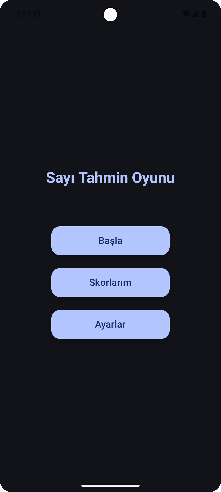
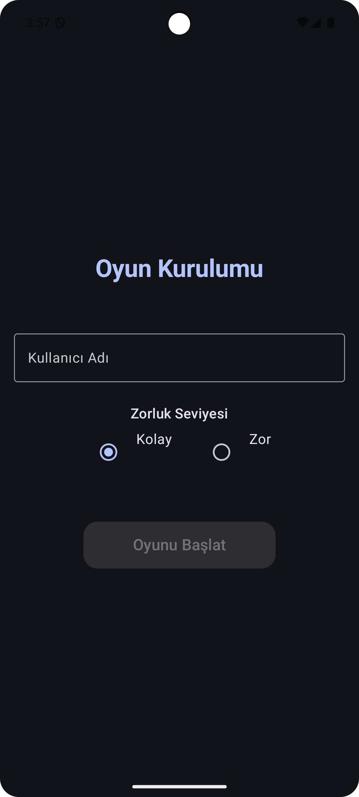
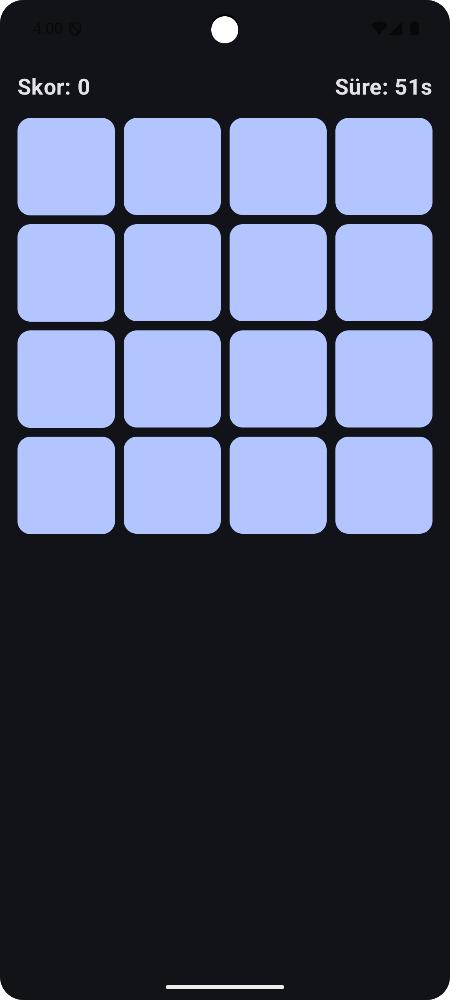
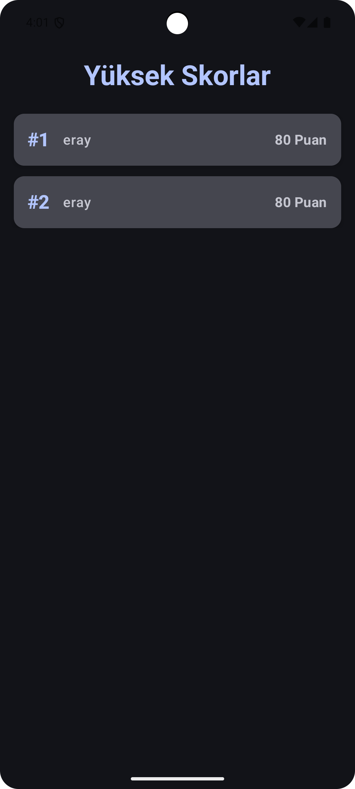
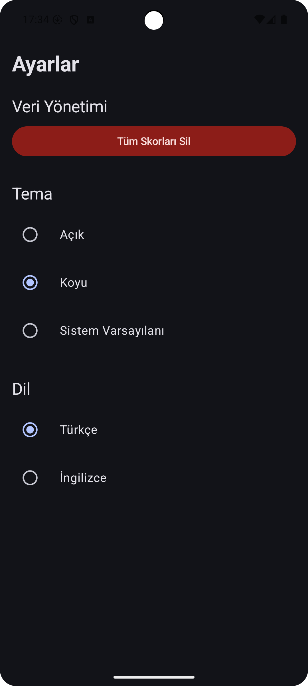

# Say Uygulaması
# Say: Hafıza ve Sayı Tahmin Oyunu

Bu proje, Android için geliştirilmiş bir sayı tahmin oyunudur. Kullanıcılar, belirli bir arayüz üzerinden rastgele üretilen sayıları tahmin etmeye çalışır. Uygulamanın temel ekranları ve işlevleri aşağıda görsellerle birlikte açıklanmıştır.
Say, modern Android için geliştirilmiş, hafıza ve sayı tahminini birleştiren keyifli bir oyundur.
Kullanıcı dostu arayüzü, tema ve dil seçenekleri, skor takibi ve zorluk derecesi ile öne çıkar.

## Ekranlar ve Açıklamalar
## Özellikler

### Ana Sayfa

Uygulamayı başlattığınızda ana sayfa ile karşılaşırsınız. Buradan oyuna başlayabilir veya ayarlara erişebilirsiniz.
- **Modern arayüz:** Jetpack Compose ile sade ve şık tasarım
- **Zorluk seçimi:** Kolay ve Zor modları ile farklı seviyelerde oynama imkânı
- **Hafıza oyunu dinamiği:** Kartları çevirip sayıları tahmin et, süreyle yarış
- **Skor takibi:** Skorlarınız kaydedilir ve en iyi skorlar sıralı şekilde gösterilir
- **Tema ve dil seçenekleri:** Açık/koyu tema ve Türkçe/İngilizce desteği, anında ayar değişimi
- **Kolay sıfırlama:** Bir dokunuşla tüm skorları silebilir, ayarları dilediğiniz gibi
  özelleştirebilirsiniz

  ## Kullanılan Teknolojiler

- **Kotlin** — Modern, güvenli ve okunaklı programlama dili
- **Jetpack Compose** — Deklaratif ve modern kullanıcı arayüzü geliştirme kütüphanesi
- **Material 3** — Güncel materyal tasarım standartları ve bileşenleri
- **MVVM (Model-View-ViewModel)** mimarisi
- **Dependency Injection (Hilt)** ile kolay test edilebilir, ölçeklenebilir yapı
- **AndroidX** ve en son Android mimari bileşenleri

## Özellikler

### Oyun Kurulumu

Oyun başlamadan önce kullanıcıdan bazı ayarlar veya bilgiler alınır. Bu ekranda oyunun zorluk seviyesi gibi seçenekler yer alır.
## Uygulama Ekranları

### Oyun Ekranı

Tahminlerinizi girdiğiniz ve oyunun aktif olarak oynandığı ekrandır. Burada mevcut tahminleriniz ve kalan haklarınızı görebilirsiniz.
<table>
  <tr>
    <td></td>
    <td></td>
    <td></td>
    <td></td>
    <td></td>
  </tr>
  <tr>
    <td align="center">Ana Sayfa</td>
    <td align="center">Oyun Kurulumu</td>
    <td align="center">Oyun Ekranı</td>
    <td align="center">Skor Ekranı</td>
    <td align="center">Ayarlar</td>
  </tr>
</table>

### Skor Ekranı

Oyun sonunda ulaştığınız skorları bu ekranda görebilirsiniz. Başarılarınızı takip edebilirsiniz.

### Ayarlar Ekranı

Uygulamanın tema, dil ve diğer ayarlarını bu ekrandan değiştirebilirsiniz.

## Lisans
Bu proje MIT lisansı ile lisanslanmıştır.

Bu proje [MIT](LICENSE) lisansı ile sunulmuştur.
